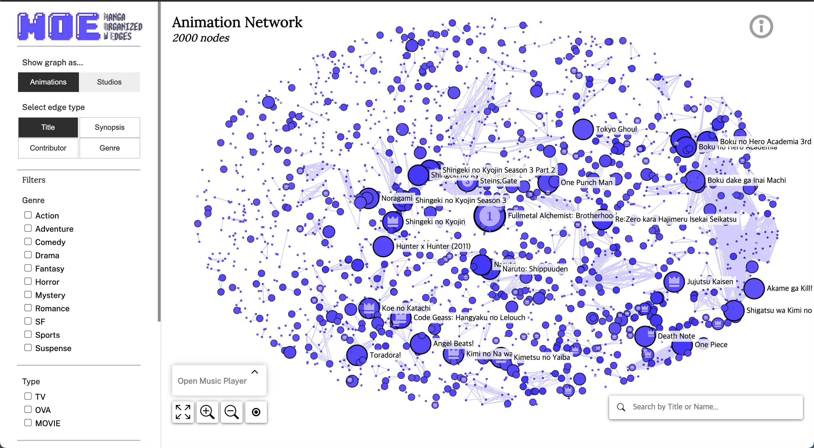
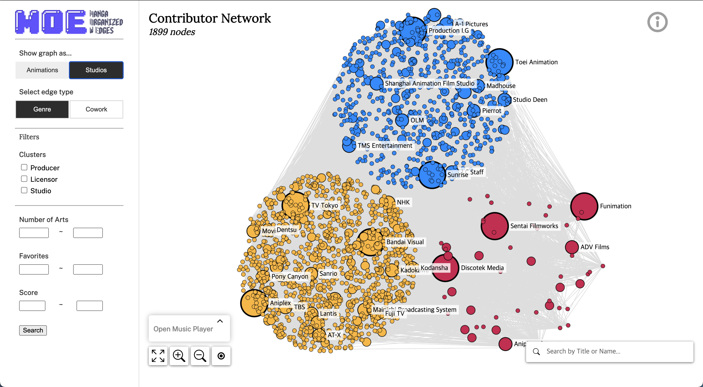

<p align="center">
  
  
</p>

[Demo Link (TBD)]()


# MOE: Manga Organized with Edges


This project is an interactive visualization system that represents anime networks using Sigma.js and React. The system is based on a dataset from the [Kaggle Anime Dataset 2023](https://www.kaggle.com/datasets/dbdmobile/myanimelist-dataset). This filtered dataset includes animations and production companies from 1961 to 2023, allowing us to visualize relationships between different animations or production companies.


## Main Contribution

MOE offers a comprehensive visualization of the anime industry by representing the intricate relationships between anime and their contributors. Utilizing explainable AI techniques, the system makes recommendation processes transparent and understandable to users. Advanced network analysis through community detection algorithms and Transformer-based pre-trained sentence embeddings reveals deeper insights and patterns within the industry. MOE enhances user engagement through diverse interaction functionalities, such as node filtering, edge type switching, and detailed node information panels. This system aids in understanding the anime industry's collaboration trends, assisting professionals in making informed decisions and serving as an educational tool for demonstrating network analysis and machine learning applications in real-world scenarios.


## Features

### Network Types
- **Animation Network**: Represents the relationships between different animations.
- **Studios Network**: Illustrates the connections between studios, licensors, and producers.

### Interactions
- **Network Type Selection**: Choose between Animation or Creator Network.
- **Edge Type Selection**: Select various types of connections for each network type.
- **Node Filtering**: Choose the type of nodes you want to see for each network type.
- **Control Panel**: Includes options for Music Play, Fullscreen, Zoom In, Zoom Out, and Reset functions.
- **Node Hover**: Highlights connected nodes and displays an information card.
- **Node Click**: Hides all other nodes except the clicked or connected ones and displays the detailed information panel for the clicked node.
  - Click on the cover image in the detailed information panel to view the synopsis or best work.
  - Click on the title in the detailed information panel to use Google search.
- **Node Drag & Drop**: Drag and drop nodes to adjust their positions for easy viewing.
- **Search Box**: Search for the work or creator you want to find.

## Nodes and Edges Details

### Animation Network

#### Nodes
- **Initial Node Placement**: Points are generated randomly to fill an ellipse with a 3:2 ratio. Community detection is performed using the [Louvain algorithm](https://en.wikipedia.org/wiki/Louvain_method). Nodes are placed sequentially from the center to the periphery based on the highest-ranked community.
- **Node Size**: Nodes are sized based on their popularity, segmented into the top 30, 100, 1000, and the remaining nodes from a total of 2000 nodes.
- **Node Color**: Colors represent the size of the cluster each node belongs to. Dark purple for series with more than 6 works, purple for series with more than 1 work, and light purple for individual works.
- **Synopsis Keyword**: Using the pre-trained Bert Base language model, 5 keywords are extracted from the synopsis for each animation.
  - *Rank: Calculated by comprehensively considering Favorites, Views, Popularity, and Score from the Anime Dataset.

#### Edges
- **Title (Default)**: Nodes are connected based on cosine similarity of their title embeddings using a pre-trained language model. Nodes with high similarity are connected, while those with lower similarity are connected only if they are produced by the same studio.
- **Synopsis**: Nodes are connected based on the similarity of their synopsis embeddings.
- **Contributors**: Nodes are connected based on the similarity of their studio names.
- **Genre**: Nodes are connected if they have identical genre vectors.

### Studios Network

#### Nodes
- **Initial Node Placement**: Three central points are defined based on the role (Licensor, Producer, Studio). Nodes are arranged around these central points with equal radii.
- **Node Size**: Nodes are sized based on the number of works produced, segmented into those with more than 400, more than 200, more than 50, and the remaining nodes.
- **Node Color**:
  - Licensor with the most works:  `#D81159` (red)
  - Producer with the most works:  `#FFBC42` (yellow)
  - Studio with the most works:  `#0496FF` (blue)

#### Edges
- **Cowork**: Nodes are connected if they worked together in the same year.
- **Genre**: Nodes are connected based on the similarity of the number of works in each genre.

## Machine Learning and Deep Learning

We applied various Machine Learning and Deep Learning algorithms to the Node and Edge Attributes of the data. This approach provides additional insights that are not immediately apparent from the dataset alone, enabling a deeper understanding of the connections and patterns within the anime industry.

## Dataset

The dataset used in this project is the [Kaggle Anime Dataset 2023](https://www.kaggle.com/datasets/dbdmobile/myanimelist-dataset), which includes animations and production companies from 1961 to 2023.

## How to Run

1. Clone the repository:
   ```bash
   git clone https://github.com/holinessnine/ani-net.git
   ```  


2. Install the dependencies:  
   ```bash 
   cd ani-net
   npm install
   ```

3. Start the development server:
   ```bash
   npm start
   ```

## Acknowledgments

We would like to thank the contributors of the [Kaggle Anime Dataset 2023](https://www.kaggle.com/datasets/dbdmobile/myanimelist-dataset) for providing the data used in this project.

## Project Status
This project is currently in beta.

